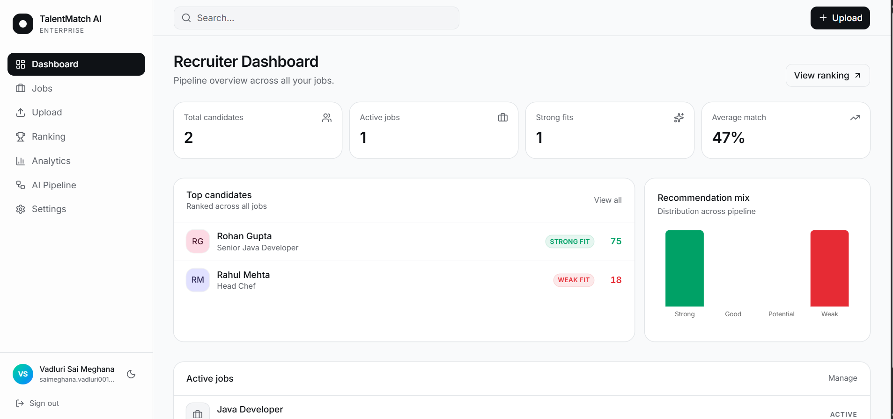
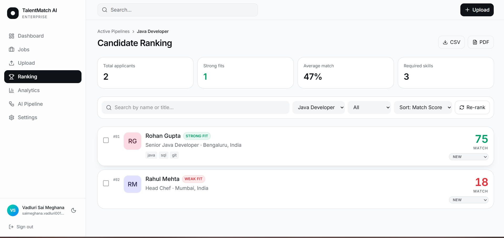
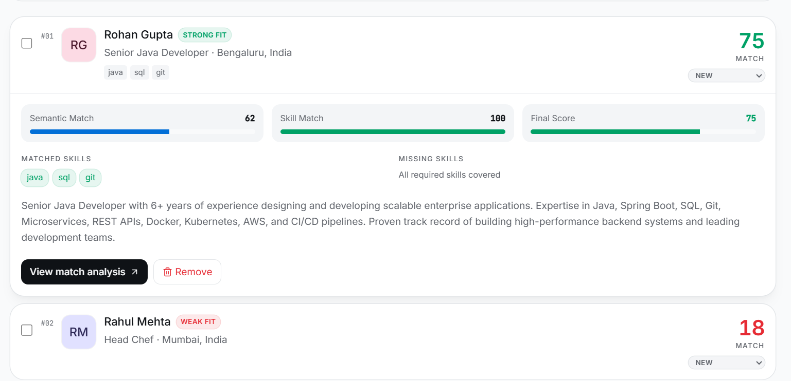
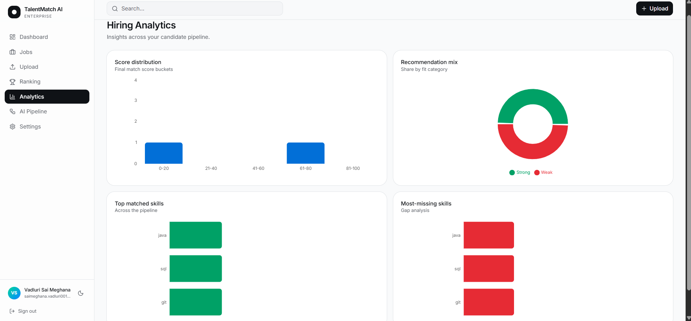

# TalentMatch AI – Enterprise AI Recruitment Platform

TalentMatch AI is an AI-powered recruitment platform that helps recruiters identify the best candidates using semantic search, vector embeddings, OCR, skill matching, and intelligent ranking.

Instead of relying only on keyword matching, the platform understands resume content and job requirements to rank candidates based on overall relevance and skill fit.

## Live Demo

https://ai-candidate-alchemy.lovable.app

## Project Overview

Recruiters often review hundreds of resumes and still miss qualified candidates because traditional Applicant Tracking Systems (ATS) rely heavily on keywords.

TalentMatch AI solves this problem by combining:

* OCR-based resume processing
* Semantic similarity search
* Skill extraction and matching
* Vector embeddings
* Hybrid candidate scoring

The platform automatically analyzes resumes, compares them with job descriptions, and generates intelligent rankings and recommendations.

---

## Key Features

### AI-Powered Candidate Ranking

* Semantic similarity scoring between resumes and job descriptions
* Vector embedding-based matching
* Intelligent ranking system

### OCR Support

* Extracts text from scanned PDF resumes
* Automatic fallback when text layers are unavailable

### Skill Matching

* Detects required skills from job descriptions
* Compares candidate skills against requirements
* Highlights matched and missing skills

### Recruiter Dashboard

* Candidate ranking table
* Recommendation categories
* Analytics and reporting

### Candidate Comparison

* Side-by-side comparison of candidates
* Skill coverage analysis
* Score breakdown visualization

### Recruiter Workflow

* Candidate status management
* Recruiter notes
* Candidate tracking

### Export & Reporting

* CSV export
* PDF export
* Ranking reports

### Authentication & Security

* Google Authentication
* Role-based access control
* Row-Level Security (RLS)

---

## Technology Stack

### AI / Machine Learning

* Sentence Transformers
* Semantic Search
* Vector Embeddings
* Cosine Similarity
* OCR

### Backend

* Supabase
* PostgreSQL
* pgvector
* Server Functions

### Frontend

* React 19
* TypeScript
* TanStack Router
* TanStack Query
* Tailwind CSS

### AI Services

* Gemini AI
* OpenAI Embeddings
* Lovable AI Gateway

### Data Processing

* PDF Processing
* OCR Pipeline
* Resume Parsing

---

## System Architecture

Resume PDF
→ Text Extraction
→ OCR Fallback (if scanned)
→ Resume Parsing
→ Embedding Generation
→ Semantic Similarity Calculation
→ Skill Matching
→ Hybrid Scoring
→ Candidate Ranking
→ Recruiter Dashboard

---

## Scoring Methodology

Semantic Score

* Generated using vector embeddings and cosine similarity
* Measures how closely a resume matches a job description

Skill Score

* Measures overlap between required skills and candidate skills

Final Score

Final Score = 0.8 × Semantic Score + 0.2 × Skill Score

Bonus Rule

* Candidates with 100% skill coverage and strong semantic relevance receive an additional bonus

Recommendation Categories

* Strong Fit: ≥ 75
* Good Fit: ≥ 60
* Potential Fit: ≥ 40
* Weak Fit: < 40

---

## Validation Testing

The system was tested using:

* Relevant vs Non-Relevant Resume Ranking
* Cross-Domain Resume Validation
* Perfect Candidate Benchmark Testing
* Recommendation Threshold Validation
* Runtime Performance Testing
* Candidate Ranking Consistency Testing

Results demonstrated successful separation of highly relevant, partially relevant, and unrelated candidates.

---

## Features Implemented

* Resume Upload
* OCR Processing
* Semantic Search
* Skill Matching
* Candidate Ranking
* Candidate Comparison
* Analytics Dashboard
* Recruiter Notes
* Candidate Status Tracking
* CSV/PDF Export
* Google Authentication
* Error Recovery & Reprocessing

---

## Future Enhancements

* Multi-language OCR
* Interview Question Generation
* AI Resume Feedback
* Candidate Shortlisting Automation
* Advanced Recruiter Analytics
* Email Notifications
* Team Collaboration Features

---

## Author

Saimeghana Vadluri

B.Tech CSE (AI & ML)
VIT-AP University

---

## Project Status

Production-Ready Portfolio Project

Successfully deployed as a full-stack AI recruitment platform with semantic search, OCR, vector embeddings, candidate ranking, and recruiter workflow management.

## Screenshots

### Landing Page

### Ranking Dashboard

### Candidate Comparison

### Analytics Dashboard

